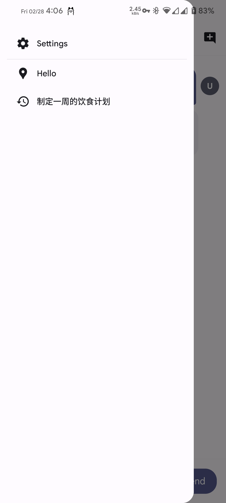
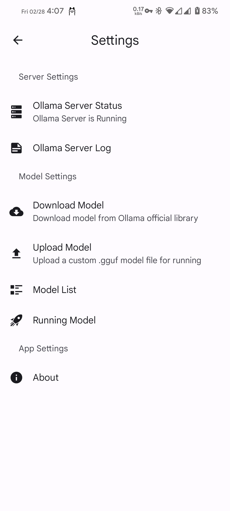

# Ollama Server

[English](./README.md)

## 介绍
Ollama Server是一个可以在Android设备上一键启动Ollama服务的项目，无需依赖Termux，即可让用户轻松在Android设备上推理语言模型。
Ollama Server所启动的Ollama服务与其他方式启动的没有差异，可以选择任何调用Ollama的客户端与Ollama服务提供的API交互。

## 特性
- **一键启动**：轻松管理 Ollama 服务。
- **无需 Termux**：无需额外的终端仿真环境。

## 目前支持的能力
- 一键启动Ollama服务
- 一键拉取Ollama官方提供的模型
- 上传自定义.gguf模型
- 删除现有模型
- 关闭正在运行的模型

## 截图

  
   
  

## 安装
1. 从 [GitHub Releases](https://github.com/your-repo/releases) 下载最新版本。
2. 在 Android 设备上安装 APK。
3. 打开APP一键启动Ollama服务。

## 致谢
特别感谢以下项目：
- **[Ollama](https://github.com/ollama/ollama)**：没有 Ollama，就没有这个项目。
- **[ChatterUI](https://github.com/chatterui/chatterui)**：提供 Markdown 插件配置参考。
- **[Iconfont](https://www.iconfont.cn/)**：提供界面所需的图标。

## 许可证
本项目采用 GPL-3 许可证进行开源。
